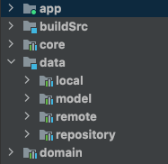
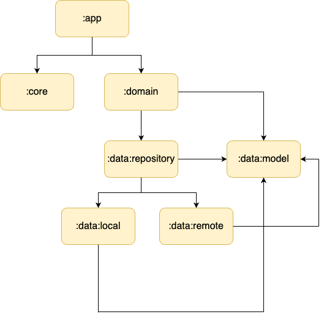

# kotlin-dsl-multi-modules-arch [Work in progress]


[](http://kotlinlang.org/)


Sample example about demonstrating how to architect a multi-module project.

<p>
  
</p>

<h3>Architectural Diagram </h3>

<p>
  
</p>

<h3>Testing </h3>

```kotlin
@ExperimentalCoroutinesApi
class CharacterDetailViewModelTest {

    private val characterUiModel = mockk<CharacterUiModel>(relaxed = true)

    private val error = mockk<Throwable>(relaxed = true)

    @get:Rule
    val testCoroutineRule = TestCoroutineRule()

    @Test
    fun `test character detail success state`() = testCoroutineRule.runTest {
        // Given
        val characterDetailUseCase = object : ICharacterDetailUseCase {
            override suspend fun invoke(id: Int): Flow<Result<CharacterUiModel>> = flow {
                emit(Result.success(characterUiModel))
            }
        }
        val viewModel = CharacterDetailViewModel(characterDetailUseCase)
        // When
        characterDetailUseCase.invoke(1).collect { result ->
            result.fold(
                onSuccess = { uiModel ->
                    viewModel.updateUiState(uiModel)
                },
                onFailure = {}
            )
            // Then
            viewModel.uiState.test {
                assertEquals(result.getOrNull(), awaitItem().character)
            }
        }
    }

    @Test
    fun `test character detail error state`() = testCoroutineRule.runTest {
        // Given
        var errorState = Throwable()
        val characterDetailUseCase = object : ICharacterDetailUseCase {
            override suspend fun invoke(id: Int): Flow<Result<CharacterUiModel>> = flow {
                emit(Result.failure(error))
            }
        }
        // When
        characterDetailUseCase.invoke(1).collectLatest { result ->
            result.fold(
                onSuccess = { },
                onFailure = { errorState = it }
            )
            // Then
            assertEquals(result.exceptionOrNull(), errorState)
        }
    }
}
```
## Built With 🛠
- [Kotlin](https://kotlinlang.org/) 
- [Coroutines](https://kotlinlang.org/docs/reference/coroutines-overview.html)
  - [Channels](https://kotlinlang.org/docs/channels.html)
- [Sandwich](https://github.com/skydoves/sandwich/blob/main/README.md) 
- [Flow](https://developer.android.com/kotlin/flow) 
  - [StateFlow](https://developer.android.com/kotlin/flow/stateflow-and-sharedflow)
- [Navigation](https://developer.android.com/guide/navigation)
- [Android Architecture Components](https://developer.android.com/topic/libraries/architecture) 
  - [ViewModel](https://developer.android.com/topic/libraries/architecture/viewmodel)
  - [DataBinding](https://developer.android.com/topic/libraries/data-binding)
- [Hilt](https://dagger.dev/hilt/)
- [Paging3.0](https://developer.android.com/topic/libraries/architecture/paging/v3-overview)
- [Retrofit](https://square.github.io/retrofit/)
- [GSON](https://github.com/google/gson) 
- [Glide](https://github.com/bumptech/glide#readme)
- [Turbine](https://github.com/cashapp/turbine/blob/trunk/README.md)
- [Material Components for Android](https://github.com/material-components/material-components-android) 


## License

```license
Copyright 2022 Doğan Can Kılıç
Licensed under the Apache License, Version 2.0 (the "License");
you may not use this file except in compliance with the License.
You may obtain a copy of the License at

    http://www.apache.org/licenses/LICENSE-2.0
    
Unless required by applicable law or agreed to in writing, software
distributed under the License is distributed on an "AS IS" BASIS,
WITHOUT WARRANTIES OR CONDITIONS OF ANY KIND, either express or implied.
See the License for the specific language governing permissions and
limitations under the License.
```
